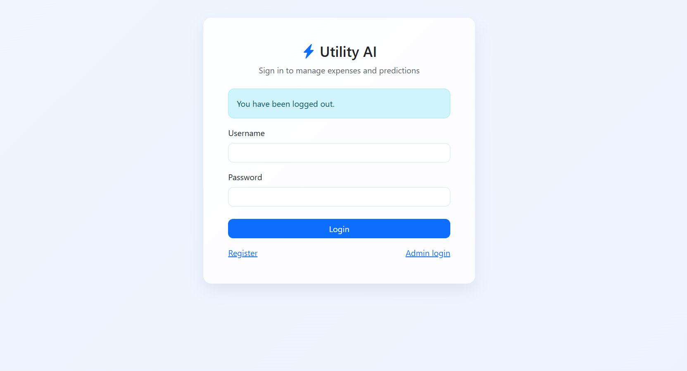
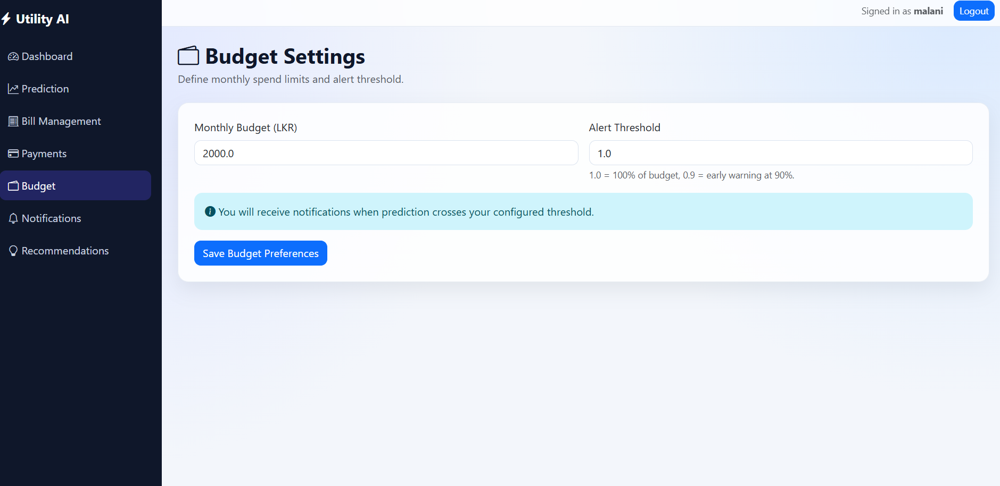
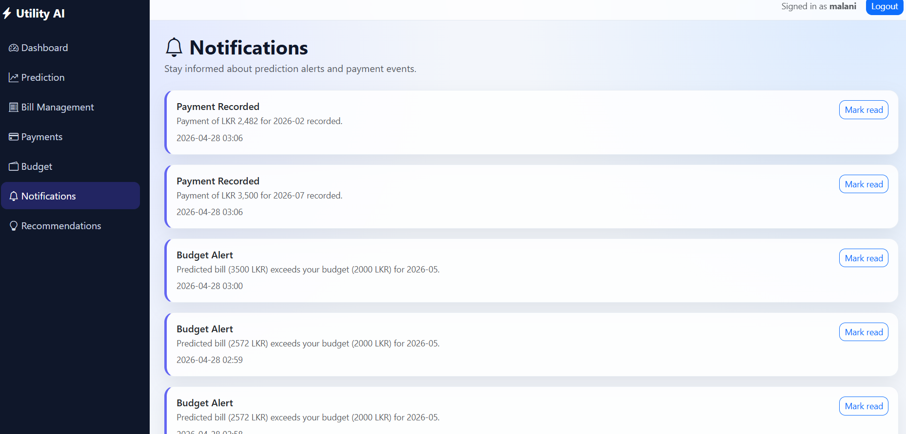
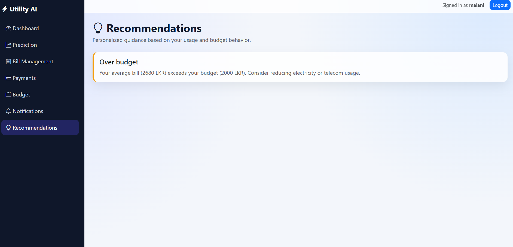
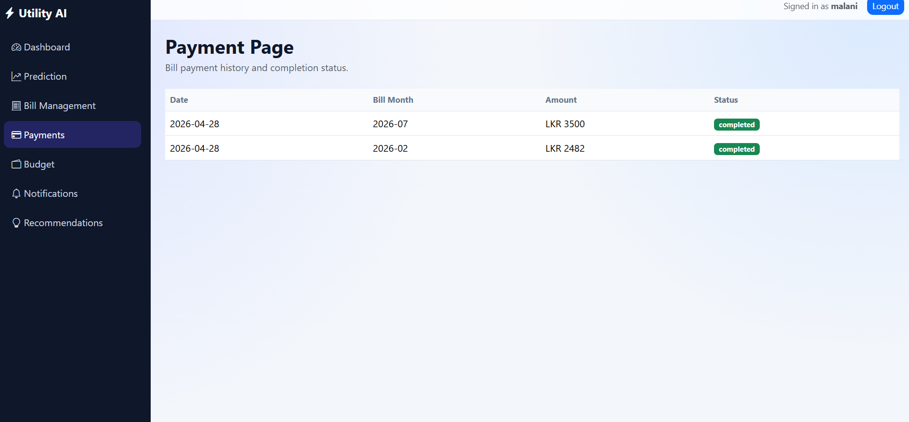

# UtiliSense AI 🚀
Smart Utility Expense Prediction, Budget Alert & Bill Tracking System

## 📌 Overview
UtiliSense AI is a data-driven web application designed to help Sri Lankan households manage and forecast their monthly utility expenses including electricity, water, and telecom bills.

The system uses machine learning models to predict future expenses and provides budget alerts, analytics dashboards, and bill payment tracking features.

---

## 🎯 Features

### 👤 User Features
- User Registration & Login
- Add Monthly Utility Bills
- Predict Next Month Bill (ML-based)
- Set Budget & Receive Alerts
- Interactive Dashboard (Charts & Insights)
- Bill Payment Simulation
- Payment History Tracking
- Export Reports

### 🛠 Admin Features
- Manage Users
- Monitor System Logs

---

## 🧠 Machine Learning

- Models Used:
  - Linear Regression (baseline)
  - Random Forest (main model)

- Techniques:
  - Feature Engineering (lag features, rolling averages)
  - Time-based analysis
  - Model evaluation (MAE, RMSE)

---

## 📊 Exploratory Data Analysis

- Monthly trend analysis
- Seasonal patterns
- Correlation analysis
- Category contribution analysis

---

## 🏗 Project Structure

/app
/src
/data/raw
/data/processed
/models
/notebooks
/reports
/database
/static
/templates
/images
/System Screenshots

---

## ⚙️ Technologies Used

- Python (Pandas, Scikit-learn)
- Flask (Backend)
- HTML, CSS, JavaScript
- Bootstrap 5
- Chart.js
- SQLite Database

---

## 📸 System Screenshots

### 🔐 Login Page

---

### 🏠 Dashboard View

---

### 📊 Prediction Result

---

### ⚠️ Notification Alert

---

### 💡 Recommendations

---

### 💳 Payment Page

---

---

## 🎯 Future Improvements

- Advanced Models (XGBoost)
- Online Payment Integration
- Mobile App Version
- Real-time API Integration

---

## 👨‍💻 Author
**Themiya Thawalpitiya**

---

## 📢 License
This project is developed for academic purposes.
